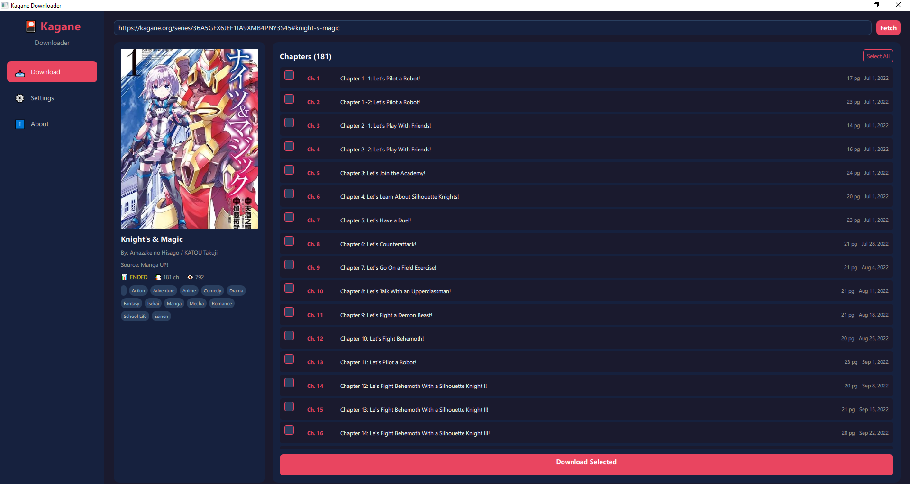

<p align="center">
  
</p>

<h1 align="center">🎴 Kagane Downloader</h1>

<p align="center">
  <b>A beautiful manga downloader for kagane.org</b>
</p>

<p align="center">
  
  
  
</p>

---

## ✨ Features

- 🖥️ **Beautiful Modern GUI** - Dark themed PyQt6 + QML interface
- 📥 **Concurrent Downloads** - Download multiple chapters simultaneously
- 📄 **Multiple Formats** - Save as Images, PDF, or CBZ
- 🔄 **Smart Retry** - Automatic retry for failed image downloads
- ⚙️ **Configurable** - Customize download settings to your preference
- 🚀 **Headless Mode** - Run without visible browser window
- 💻 **CLI Support** - Full-featured command line interface

## 🚀 Installation

```bash
# Clone the repository
git clone https://github.com/Yui007/kagane-downloader.git
cd kagane-downloader

# Install dependencies
pip install -r requirements.txt
```

## 📖 Usage

### GUI Mode (Recommended)
```bash
python gui/main.py
```

### CLI Mode
```bash
python main.py
```

### Direct Download
```bash
python main.py download --url "https://kagane.org/series/..."
```

## ⚙️ Configuration

| Setting | Description | Default |
|---------|-------------|---------|
| `download_format` | Output format (images/pdf/cbz) | `images` |
| `max_concurrent_chapters` | Chapters to download at once | `3` |
| `image_load_delay` | Seconds to wait for images | `15` |
| `max_retries` | Retry attempts for failed images | `3` |
| `download_directory` | Where to save downloads | `downloads` |

## 📁 Project Structure

```
kagane-downloader/
├── gui/                    # PyQt6 + QML GUI
│   ├── main.py            # GUI entry point
│   ├── backend/           # Python workers
│   └── qml/               # QML UI files
├── src/
│   ├── scraper/           # Browser & scraping logic
│   ├── converter/         # PDF & CBZ conversion
│   └── utils/             # Helper utilities
├── main.py                # CLI entry point
└── config.py              # Configuration management
```

## 🛠️ Requirements

- Python 3.10+
- Chrome/Chromium browser
- Dependencies: `undetected-chromedriver`, `PyQt6`, `typer`, `rich`, `pillow`, `img2pdf`

## 📝 License

MIT License - feel free to use and modify!

---

<p align="center">
  Made with ❤️ for manga lovers
</p>
